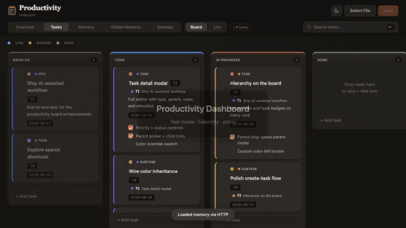

# Claude Code Productivity Dashboard

A modular, local-first productivity dashboard designed for [Claude Code](https://docs.anthropic.com/en/docs/claude-code). Manage tasks on a Kanban board, maintain contextual memory files, and automate daily standups — all from your browser, with real-time sync to your filesystem.

> Based on Anthropic's [productivity plugin](https://github.com/anthropics/knowledge-work-plugins/tree/main/productivity), with significant enhancements.

[](LICENSE)



## Key Enhancements Over Upstream

| Feature | Upstream Plugin | This Dashboard |
|---------|----------------|----------------|
| Dashboard | Single monolithic HTML file | Modular JS + CSS |
| Server | None (FileSystem API only) | Custom Node.js server with REST API |
| Task Board | Basic | Kanban with priorities, types, due dates, labels, filters, swimlanes, keyboard, bulk actions |
| Task Editing | External only | Detail + create modals (hierarchy, due, blocked, estimate, assignee, links, history) |
| Hierarchy | None | Epic → Task → Subtask with parent/child navigation |
| Colors | None | Per-type defaults, parent inheritance, optional per-task override |
| Memory Management | Read-only display | Full CRUD with modal editor + inline editing |
| Search | None | Full-text search + faceted task filters |
| Theme | None | Dark-first design with light mode toggle |
| Views | Single view | Board view + list view |
| Overview | None | Sprint tracker, deadlines, blocked count, estimate total, deep links to Tasks |
| Automation | None | Daily summary (Claude Desktop scheduled tasks / optional scripts) |
| Config | Hardcoded | External `config.json` (links, sprints, WIP limits, Slack) |
| Global Memory | None | View/edit Claude's cross-project memory |

## Quick Start

```bash
# Clone the repository
git clone https://github.com/Diabl0269/productivity-dashboard.git
cd productivity-dashboard

# Set up your personal configuration
cp config.example.json config.json
cp tasks.example.json tasks.json
cp CLAUDE.md.example CLAUDE.md
cp -r memory.example/ memory/

# Edit config.json with your links, sprint schedule, and optional wipLimit
# Edit CLAUDE.md with your team info and context
# Prefer `ch tasks` (see cli/README.md) over editing tasks.json by hand

# Start the dashboard
node serve.js
# Open http://localhost:3000/dashboard/
```

**Prerequisites:** Node.js v14+ and a modern browser.

## Configuration

### config.json

Controls Overview widgets and soft WIP limits. Copy `config.example.json` and customize:

```json
{
  "quickLinks": [
    { "icon": "📊", "label": "Jira Board", "url": "https://..." }
  ],
  "sprints": [
    { "name": "Q1 S1", "start": "2026-01-01", "end": "2026-01-21" }
  ],
  "wipLimit": 5,
  "wipLimits": { "in-progress": 5 },
  "defaultWorkshops": [
    { "name": "Team Workshop", "status": "planned" }
  ]
}
```

- `wipLimit` — soft max cards for In Progress (board header warning when exceeded)
- `wipLimits` — optional per-section overrides (same soft-limit behavior)

Full task CLI and `tasks.json` field reference: [`cli/README.md`](cli/README.md).
### CLAUDE.md

Your project's context file — Claude Code reads this to understand your team, terminology, projects, and processes. Copy `CLAUDE.md.example` and fill in your details.

### memory/

Directory of markdown files that store persistent context:
- `memory/glossary.md` — Acronyms and internal terminology
- `memory/people/` — Team member profiles
- `memory/projects/` — Project documentation
- `memory/context/` — Company and organizational context

See `memory.example/` for the expected format.

## Features

### Kanban Board
- **Columns:** Backlog, Todo, In Progress, Done, Archive
- **Drag & Drop:** Move tasks between columns
- **Priority Indicators:** Clickable dots — blue (low), yellow (medium), red (high)
- **Type Badges & Colors:** Epic / Task / Subtask badges with colored left borders (inherit from parent or override)
- **Due Dates:** First-class `dueDate` with urgency styling on cards; Overview deadlines prefer this field
- **Blocked / Waiting:** Flag tasks as blocked with optional free-text `waitingOn`; peer deps via `blockedBy`
- **Labels & Links:** Free-form tags and external URL links on tasks
- **Assignee:** Free-text name/slug (`assignee`); filterable
- **Time estimate:** `estimateMinutes` (integer minutes) — display as `30m` / `2h` / `1d` (1d = 8h). Not story points.
- **Activity log:** Lightweight `history` entries on moves / priority / blocked / assignee / estimate
- **Bulk select:** Checkbox or ⌘/Ctrl-click; bulk move, priority, archive, label, block, delete
- **Undo delete:** Soft-delete with Undo toast (~7s)
- **Swimlanes:** Toggle to group board by parent epic
- **Keyboard:** `n` new, `j`/`k` navigate, `h`/`l` move columns, `1`/`2`/`3` priority, `Enter` detail, `x` select, `⌫` delete, `Esc` clear (press `?` for hint)
- **Faceted Filters:** Priority, type, due, parent, blocked, section, label, assignee pills (AND with text search)
- **WIP Limits:** Soft In Progress limit via `config.json` (`wipLimit` or `wipLimits`)
- **Parent Links:** Cards show a parent chip that opens the parent in the detail modal
- **Task Detail Modal:** Full record including estimate, assignee, activity timeline
- **Create Modal:** `+ Add task` opens a full create form with hierarchy and color controls
- **Auto-sync:** Polls `tasks.json` every 2 seconds for external changes

### List View
- Flat list of all tasks with status, priority, type, parent links, due/blocked badges, and notes
- Alternative to the board for quick scanning

### Ticket Types (Settings)
- Configure types with colors and **which types can be parents** (Link under checkboxes)
- A Bug can link under Epic or Task, or stay standalone — not forced into a single linear chain
- Add, rename, reorder, or remove types in Settings → Ticket Types (saved to `tasks.json`)
- Colors flow onto cards, parent chips, and the detail/create modals

### Memory Viewer
- Browse all memory files organized by directory
- View detailed content of people, projects, and context files
- Inline edit fields and table cells directly
- Modal editor for adding/updating people and project records

### Overview Tab
- **Sprint Tracker:** Progress bar for current sprint (configured in `config.json`)
- **Task Summary:** Counts for in-progress, todo, done, and blocked — click to open Tasks with that filter; total time estimate for active work
- **Upcoming Deadlines:** Prefer `dueDate`; fall back to dates scraped from descriptions
- **Quick Links:** Configurable shortcuts to your tools (Jira, Notion, Slack, etc.)
- **1:1 Topics:** Scratchpad for manager meeting topics
- **Workshops:** Track workshop status (planned, in-progress, done)

### Dark/Light Mode
- Dark theme is the default; toggle to light in the top-right corner
- Preference saved to localStorage
- Both themes share a single design-token system (`dashboard/styles/base.css`)

## Daily Automation (macOS LaunchAgent)

Automate daily productivity summaries that run every morning and send you a Slack DM with findings from Jira, Notion, Slack, and your memory files.

### Setup

1. Copy and customize the script:
   ```bash
   cp scripts/daily-update.sh.example scripts/daily-update.sh
   chmod +x scripts/daily-update.sh
   # Edit the CUSTOMIZE THESE section at the top
   ```

2. Create the LaunchAgent plist:
   ```bash
   cat > ~/Library/LaunchAgents/com.claude.daily-update.plist << 'EOF'
   <?xml version="1.0" encoding="UTF-8"?>
   <!DOCTYPE plist PUBLIC "-//Apple//DTD PLIST 1.0//EN" "http://www.apple.com/DTDs/PropertyList-1.0.dtd">
   <plist version="1.0">
   <dict>
     <key>Label</key>
     <string>com.claude.daily-update</string>
     <key>ProgramArguments</key>
     <array>
       <string>/bin/bash</string>
       <string>/path/to/your/scripts/daily-update.sh</string>
     </array>
     <key>StartCalendarInterval</key>
     <dict>
       <key>Hour</key>
       <integer>9</integer>
       <key>Minute</key>
       <integer>0</integer>
     </dict>
     <key>StandardOutPath</key>
     <string>/tmp/claude-daily-update-launchd.log</string>
     <key>StandardErrorPath</key>
     <string>/tmp/claude-daily-update-launchd.log</string>
     <key>WorkingDirectory</key>
     <string>/Users/YOUR_USERNAME</string>
   </dict>
   </plist>
   EOF
   ```

3. Load the agent:
   ```bash
   launchctl load ~/Library/LaunchAgents/com.claude.daily-update.plist
   ```

4. Verify it's scheduled:
   ```bash
   launchctl list | grep claude
   ```

To unload: `launchctl unload ~/Library/LaunchAgents/com.claude.daily-update.plist`

### What the Daily Update Does

1. Runs `claude -p` non-interactively with the `/productivity:update --comprehensive` command
2. Gathers data from Jira, Notion, Slack, and your memory files
3. Compiles a structured report
4. Sends a Slack DM with findings (new tickets, missed action items, stale tasks)
5. Includes a resume command so you can follow up interactively

## Claude Desktop / Claude Code Integration

### Basic Setup

1. Open the project directory in Claude Code (CLI, Desktop, or IDE extension)
2. Claude will automatically read `CLAUDE.md` and `memory/` files for context
3. Use `/productivity:start` to initialize the system on first run
4. Use `/productivity:update` to sync tasks and refresh memory

### Scheduling via Claude Code (`/schedule`)

Claude Code has a built-in `/schedule` command that creates recurring remote agents — no LaunchAgent or cron needed:

```bash
# Schedule a daily productivity update at 9:00 AM
/schedule create --cron "0 9 * * 1-5" --name "daily-update" --prompt "Run /productivity:update --comprehensive. Gather all data from Jira, Notion, and Slack. Compile a structured report and send a Slack DM to user YOUR_SLACK_USER_ID with the findings. Do not ask questions or wait for input."
```

Manage your scheduled agents:
```bash
/schedule list          # View all scheduled agents
/schedule run <name>    # Run one immediately
/schedule delete <name> # Remove a scheduled agent
```

This is the simplest option — it works across macOS, Linux, and Windows with no OS-specific configuration.

### Scheduling via Claude Desktop App

You can also manage scheduled agents through the Claude Desktop app UI:

1. Open **Claude Desktop** → **Settings** → **Scheduled Agents**
2. Click **Create New** and configure:
   - **Name:** `daily-update`
   - **Schedule:** Weekdays at 9:00 AM (or your preferred time)
   - **Working Directory:** path to this project
   - **Prompt:** your update instructions (see example above)
3. The agent runs automatically on schedule and you can view run history in the app

## Project Structure

```
.
├── config.example.json          # Dashboard config template (includes wipLimit)
├── CLAUDE.md.example            # Project context template
├── tasks.example.json           # Canonical tasks.json template
├── TASKS.md.example             # Legacy markdown snapshot template
├── serve.js                     # Zero-dependency Node.js dev server
├── dashboard/
│   ├── index.html               # Single-page app shell
│   ├── js/
│   │   ├── main.js              # Entry point, config loading
│   │   ├── tasks-json.js        # tasks.json load/save
│   │   ├── tasks-board.js       # Kanban board rendering
│   │   ├── tasks-list.js        # List view rendering
│   │   ├── tasks-io.js          # Task file I/O
│   │   ├── tasks-main.js        # Task rendering coordination
│   │   ├── task-fields.js       # Shared field helpers (due, estimate, …)
│   │   ├── task-filters.js      # Faceted board/list filters
│   │   ├── memory-parser.js     # Memory file parsing
│   │   ├── memory-renderer.js   # Memory tab UI
│   │   ├── memory-modal.js      # Modal editor for memory
│   │   ├── inline-edit.js       # Click-to-edit fields
│   │   ├── http-loader.js       # HTTP API integration
│   │   ├── state.js             # Shared app state
│   │   ├── overview.js          # Overview tab widgets
│   │   ├── search.js            # Full-text search
│   │   ├── global-memory.js     # Cross-project memory
│   │   ├── persistence.js       # IndexedDB + FileSystem API
│   │   └── theme.js             # Dark/light mode
│   └── styles/
│       ├── base.css             # Core layout and typography
│       ├── tasks.css            # Task board and list styles
│       ├── memory.css           # Memory viewer styles
│       ├── modal.css            # Modal dialog styles
│       ├── overview.css         # Overview tab styles
│       ├── global-memory.css    # Global memory styles
│       └── misc.css             # Utility classes
├── memory.example/              # Example memory directory
│   ├── MEMORY.md
│   ├── glossary.md
│   ├── context/company.md
│   ├── people/jane-doe.md
│   └── projects/example-project.md
└── scripts/
    └── daily-update.sh.example  # Automated daily summary template
```

## API Endpoints

The `serve.js` server provides:

| Endpoint | Method | Description |
|----------|--------|-------------|
| `/api/memory-manifest` | GET | Returns manifest of all memory files with content |
| `/api/save` | POST | Saves updates to `tasks.json` or memory files |
| `/api/global-memory` | GET | Reads Claude's cross-project global memory |
| `/api/global-save` | POST | Saves to global memory directory |

## File Formats

### tasks.json

Canonical task store (gitignored). Copy `tasks.example.json`. Full schema: [`cli/README.md`](cli/README.md).

Notable optional fields: `dueDate`, `blocked`, `waitingOn`, `assignee`, `estimateMinutes` (minutes — **not** story points; display as `30m`/`2h`/`1d`), `labels`, `links`, `blockedBy`, `history`.

```bash
ch tasks add "Ship release notes" --due 2026-09-01 --estimate 2h --assignee alex --label docs
ch tasks update T7 --blocked --waiting-on "design review" --add-link https://example.com
ch tasks dump --active
```

### TASKS.md (legacy / export)

Markdown is no longer the source of truth. Use `ch tasks export --md` for a readable snapshot. Older HTML-comment metadata examples:

```markdown
## Todo

- [ ] Task title
  - Optional subtask or note
  <!-- created:2026-01-15 priority:medium -->
```

HTML comments historically stored `created` (YYYY-MM-DD) and `priority` (low, medium, high).

### Memory Files

```markdown
---
name: Person Name
description: Brief description for indexing
type: user
---

## Profile
- **Role:** Developer
- **Team:** Alpha
- **Email:** person@company.com

## Context
Notes about this person.
```

## Contributing

See [CONTRIBUTING.md](CONTRIBUTING.md) for development setup, code style guidelines, and how to submit changes.

## License

This project is licensed under the [Apache License 2.0](LICENSE).

Based on the [Anthropic Productivity Plugin](https://github.com/anthropics/knowledge-work-plugins/tree/main/productivity) — enhanced with a modular dashboard, custom server, and daily automation.
